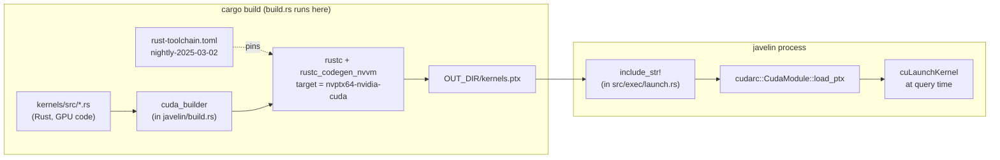

# 04 — Build-System Integration for Javelin 0.3 (rust-cuda)

Status: design draft. Targets Javelin's planned migration from runtime
string-emitted PTX to compile-time Rust-to-PTX via `rustc_codegen_nvvm`.

All claims about the upstream toolchain are dated; the rust-cuda project
was unarchived and rebooted in late 2024, with the headline modernization
landing in March 2025 (`nightly-2025-03-02`). See the Rust GPU project
update of 2025-03-18 ([rust-gpu.github.io/blog/2025/03/18/rust-cuda-update/](https://rust-gpu.github.io/blog/2025/03/18/rust-cuda-update/)).

---

## 1. Workspace shape

Javelin today is a single crate with a single `Cargo.toml`. rust-cuda
fundamentally requires a *separate compilation unit* for code that runs
on the GPU, because that unit must target `nvptx64-nvidia-cuda` and use
the alternative codegen backend. The canonical layout in the rust-cuda
guide ([Getting Started](https://rust-gpu.github.io/rust-cuda/guide/getting_started.html))
is a Cargo workspace:

```
javelin/
├── Cargo.toml              # workspace root + host crate
├── rust-toolchain.toml     # (omitted at root — see §5)
├── .cargo/config.toml      # optional; see §2
├── build.rs                # host build script; runs cuda_builder
├── src/                    # existing Javelin host code
├── kernels/
│   ├── Cargo.toml          # crate-type = ["cdylib", "rlib"]
│   ├── rust-toolchain.toml # pins nightly-2025-03-02 (or current)
│   ├── src/
│   │   ├── lib.rs
│   │   ├── partition.rs
│   │   ├── scatter.rs
│   │   └── shmem_sum.rs
│   └── (no build.rs needed)
└── target/
    └── nvptx64-nvidia-cuda/release/kernels.ptx
```

`kernels/Cargo.toml` must declare:

```toml
[lib]
crate-type = ["cdylib", "rlib"]
```

The guide is explicit that "nvptx targets do not support binary crate
types" — `cdylib` is what `rustc_codegen_nvvm` emits PTX from, and the
`rlib` half keeps the kernel crate usable as a regular dependency for
type sharing with the host. `cuda_std` (the GPU-side runtime) is the
required dependency.

## 2. `rustc_codegen_nvvm` invocation

Two paths to actually invoke the NVVM backend:

**Path A — direct rustflags.** Set in `.cargo/config.toml`:

```toml
[target.nvptx64-nvidia-cuda]
rustflags = ["-Zcodegen-backend=nvvm"]
```

This requires nightly (`-Z` flags) and that the `rustc_codegen_nvvm.so`
/ `.dll` is on `LD_LIBRARY_PATH` / `PATH`. Workable but brittle.

**Path B — `cuda_builder` (recommended).** The host's `build.rs` calls
`cuda_builder::CudaBuilder`, which internally shells out to the right
rustc with the right flags. Pattern from the guide:

```rust
// build.rs at javelin/build.rs
use std::{env, path::PathBuf};
use cuda_builder::CudaBuilder;

fn main() {
    let manifest = PathBuf::from(env!("CARGO_MANIFEST_DIR"));
    let out_dir  = PathBuf::from(env::var("OUT_DIR").unwrap());

    CudaBuilder::new(manifest.join("kernels"))
        .copy_to(out_dir.join("kernels.ptx"))
        .arch(cuda_builder::NvvmArch::Compute75)  // tune per Javelin support matrix
        .build()
        .unwrap();
}
```

`cuda_builder` is the analogue of `spirv_builder` (rust-gpu) and is
the documented entry point. Path B is recommended because it hides the
rustflags / linker dance and tracks upstream changes.

**Toolchain required.** As of 2025-03, rust-cuda pins
`nightly-2025-03-02`. The guide instructs users to *copy* the
`rust-toolchain.toml` from the rust-cuda repo verbatim into their kernel
crate, because `rustc_codegen_nvvm` links rustc internals. Issue #260
in the repo confirms that mismatched nightlies break the build.

**System requirements** (from the March 2025 update):
- CUDA toolkit 12.x (experimental) or 11.x. CUDA 13 mentioned as supported.
- LLVM 7.x (a fork is bundled / linked by the codegen crate).
- NVIDIA compute capability >= 5.0.
- Windows: VS Build Tools (C++ workload) + `%CUDA_PATH%\nvvm\bin` on PATH.

## 3. Host-side consumption pattern

Two ways for the host crate to obtain the PTX:

**(a) "Find the file" approach.** Build the kernel crate as a separate
cargo target (`cargo build -p kernels --target nvptx64-nvidia-cuda --release`).
The host `build.rs` globs `target/nvptx64-nvidia-cuda/release/*.ptx`,
copies them into `OUT_DIR`, and `include_str!` from host code. Pros:
maximum transparency. Cons: bespoke glue, easy to break, doesn't track
nightly changes.

**(b) `cuda_builder` approach.** As shown in §2. `CudaBuilder::build()`
orchestrates everything; `.copy_to(OUT_DIR/kernels.ptx)` writes a stable
path. Host code:

```rust
pub static KERNELS_PTX: &str = include_str!(concat!(env!("OUT_DIR"), "/kernels.ptx"));
// then at runtime, with cudarc:
let module = CudaModule::load_ptx(KERNELS_PTX)?;
```

**Recommendation: (b).** It is the officially documented path, it is
what every rust-cuda example uses, and it absorbs upstream changes to
the nvptx target flags. (a) is only worthwhile if Javelin needs to
build PTX outside of cargo (e.g. a Bazel migration), which is not on
the 0.3 roadmap.

## 4. Caching / incremental rebuilds

`cuda_builder` emits its own `cargo:rerun-if-changed=…` directives for
the kernel crate's source tree, so a host-only edit (e.g. tweaking
`src/exec/launch.rs`) does *not* rebuild PTX. Belt-and-suspenders:

```rust
// build.rs
println!("cargo:rerun-if-changed=kernels/src");
println!("cargo:rerun-if-changed=kernels/Cargo.toml");
println!("cargo:rerun-if-changed=kernels/rust-toolchain.toml");
```

**Checking PTX into git.** PTX text is deterministic given a pinned
rustc + LLVM + CUDA toolkit, but in practice the determinism is fragile
(LLVM bumps, NVVM version drift). Recommendation: do **not** check PTX
into git as a primary artifact. Instead:

- CI builds PTX from source on every push.
- A `kernels/snapshot/` directory holds the *last-known-good* PTX
  blobs as a *fallback* for the disaster-recovery path in §7.
- Releases ship the freshly-built PTX inside the wheel/binary.

Skipping kernel recompile in CI is a 30-second optimization at best
(`cuda_builder` is fast); the maintenance cost of stale-PTX bugs is
much larger.

## 5. Toolchain pinning

The naive option — a single `rust-toolchain.toml` at the workspace
root pinning `nightly-2025-03-02` — drags every Javelin contributor
onto nightly, including those who never touch GPU code. This is the
wrong default.

rustup resolves `rust-toolchain.toml` by walking *upwards* from the
current directory ([rustup docs, Overrides](https://rust-lang.github.io/rustup/overrides.html)),
preferring the nearest file. That means a workspace can mix toolchains
per member by placing a `rust-toolchain.toml` *inside* the member
directory:

```
javelin/
├── rust-toolchain.toml         # channel = "stable"  (or omitted)
└── kernels/
    └── rust-toolchain.toml     # channel = "nightly-2025-03-02"
                                # components = ["rust-src", "llvm-tools-preview"]
```

**This works for `cuda_builder`** because the builder spawns a fresh
cargo invocation rooted in the `kernels/` directory, where rustup picks
up the nightly override. The host crate continues to compile on
stable. Verified pattern: it is the layout used in the rust-cuda
examples directory.

Caveat: a single `cargo build` from the workspace root that *compiles
the kernel crate as a normal workspace member* would try to use the
root toolchain. We avoid this by **not listing `kernels` in
`[workspace.members]`** — it is invoked exclusively through
`cuda_builder`, which treats it as an external crate.

## 6. Feature-flag interaction with `cuda-stub`

Javelin currently has a `cuda-stub` feature for docs.rs and for
contributors on machines without a CUDA toolkit. After the migration,
`cuda_builder` itself requires CUDA + LLVM 7 + nvptx target installed,
which most docs.rs builders do not have.

Strategy: gate the entire PTX-build step on a feature flag.

```rust
// build.rs
fn main() {
    if cfg!(feature = "rust-cuda") {
        // run cuda_builder ...
    } else {
        // emit a stub kernels.ptx (or an empty include) so include_str!
        // in src/ still compiles.
        let out = std::path::PathBuf::from(std::env::var("OUT_DIR").unwrap());
        std::fs::write(out.join("kernels.ptx"), "").unwrap();
    }
}
```

Host code that loads the PTX is itself behind `#[cfg(not(feature = "cuda-stub"))]`,
so the empty file is never read. `cargo doc --features cuda-stub --no-default-features`
stays green because no rust-cuda toolchain is invoked. docs.rs
metadata is set the same way.

## 7. Fallback / disaster recovery

`rustc_codegen_nvvm` is a *known-fragile* dependency. It pins rustc
internals and historically went three years without a working build
(2021 → 2024). The 2025 reboot has a small maintainer pool. Javelin
must have a recovery path:

1. **Snapshot PTX in `kernels/snapshot/`.** On every green release,
   the CI publishes the produced PTX into a git-tracked snapshot.
   If `cuda_builder` breaks (e.g. nightly bump, NVVM regression), the
   build script falls back to loading the snapshot file. This is a
   bandage, not a fix — kernel source changes will be silently ignored
   until the codegen is repaired.
2. **Keep the hand-emitted PTX path behind a feature flag for one
   release cycle.** The existing string-emitting code in `src/jit/`
   already produces working PTX; deleting it on day one of the
   migration removes our only escape hatch. Plan: 0.3 ships
   `--features rust-cuda` as opt-in alongside the legacy path; 0.4
   flips the default; 0.5 deletes the legacy path. If anything goes
   wrong between 0.3 and 0.5, users can revert with one feature flag.
3. **CI matrix.** Build both paths on every PR — at least until 0.4.

## 8. Build pipeline diagram



---

## Two concrete options for Javelin 0.3

### Option A — Full workspace + nvvm adoption

Move all kernels in `src/jit/*.rs` into a new `kernels/` crate, delete
the string-emission paths, switch `build.rs` to `cuda_builder`, ship
PTX via `include_str!` + `cudarc`. Host crate stays on stable; kernel
crate pins `nightly-2025-03-02`.

- **Effort:** ~1 month (1 engineer). Bulk of the work is porting the
  ~15 hand-written PTX kernels in `src/jit/` to safe Rust against
  `cuda_std`, plus CI plumbing (CUDA toolchain on Linux + Windows
  runners), plus dealing with the inevitable LLVM 7 / NVVM oddities.
- **Pros:** kernels become real, debuggable Rust. Shared types
  between host and device. `cargo check` covers kernel code.
- **Cons:** binds Javelin to a small upstream project. Every nightly
  bump in rust-cuda becomes a Javelin chore. CUDA toolkit becomes a
  hard build dependency for any contributor who wants to touch
  kernel code.

### Option B — Hybrid spike with feature flag

Keep `src/jit/*` (the current string-emitting PTX) as the default.
Add a `kernels/` crate and a `rust-cuda` feature; behind that flag,
`build.rs` invokes `cuda_builder` and the runtime loads
`OUT_DIR/kernels.ptx` instead of the string-emitted version. Port
two or three kernels (`partition_kernel`, `shmem_sum_kernel`) as a
proof of concept.

- **Effort:** ~2 weeks (1 engineer). Workspace plumbing + two ported
  kernels + CI job that exercises `--features rust-cuda`.
- **Pros:** zero risk to existing users. Lets us learn the rust-cuda
  developer experience on real Javelin kernels before committing.
  If upstream regresses, we delete the feature with no user impact.
- **Cons:** two codepaths to maintain for 1–2 releases. Doesn't
  realize the "kernels are real Rust" benefits until we commit.

**Recommendation:** B first (0.3), A as the 0.4 default once the
upstream toolchain has been stable for at least one more nightly bump
cycle and the rust-cuda CI infrastructure has demonstrated it can
survive a Rust release without breaking.

---

### Sources

- [Rust CUDA Getting Started guide](https://rust-gpu.github.io/rust-cuda/guide/getting_started.html)
- [Rust CUDA project update — 2025-03-18](https://rust-gpu.github.io/blog/2025/03/18/rust-cuda-update/)
- [Rust running on every GPU — 2025-07-25](https://rust-gpu.github.io/blog/2025/07/25/rust-on-every-gpu/)
- [rustc_codegen_nvvm technical notes](https://rust-gpu.github.io/Rust-CUDA/nvvm/technical/nvvm.html)
- [rust-cuda issue #260 — toolchain mismatch](https://github.com/Rust-GPU/rust-cuda/issues/260)
- [rustup overrides — per-directory `rust-toolchain.toml`](https://rust-lang.github.io/rustup/overrides.html)
- [Rust-CUDA repository — `getting_started.md`](https://github.com/Rust-GPU/Rust-CUDA/blob/main/guide/src/guide/getting_started.md)
